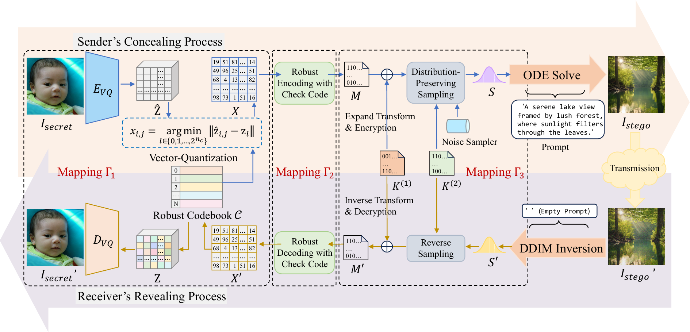
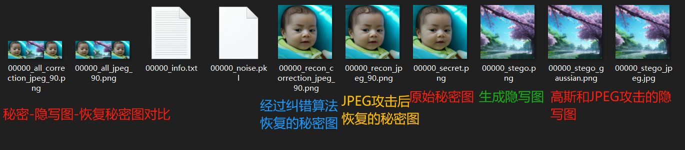

# Implementation of Robust Generative Steganography for Image Hiding Using Concatenated Mappings

Please Check out our paper for more details before you read the code.  [IEEE Xplore](https://ieeexplore.ieee.org/abstract/document/11018098)

The original framework for this code is based on the brilliant work of [EDICT](https://github.com/salesforce/EDICT)! 

# Abstract



Generative steganography stands as a promising technique for information hiding, primarily due to its remarkable resistance to steganalysis detection. Despite its potential, hiding a secret image using existing generative steganographic models remains a challenge, especially in lossy or noisy communication channels. This paper proposes a robust generative steganography model for hiding full-size image. It lies on three reversible concatenated mappings proposed. The first mapping uses VQGAN with an order-preserving codebook to compress an image into a more concise representation. The second mapping incorporates error correction to further convert the representation into a robust binary representation. The third mapping devises a distribution-preserving sampling mapping that transforms the binary representation into the latent representation. This latent representation is then used as input for a text-to-image Diffusion model, which generates the final stego image. Experimental results show that our proposed scheme can freely customize the stego image content. Moreover, it simultaneously attains high stego and recovery image quality, high robustness, and provable security.


# Setup

## HF Auth token

Paste a copy of a suitable [HF Auth Token](https://huggingface.co/docs/hub/security-tokens) into [hf_auth](hf_auth) with no new line (to be read by the following code in `edict_functions.py`)

```
with open('hf_auth', 'r') as f:
    auth_token = f.readlines()[0].strip()
```

Example file at `./hf_auth`

```
abc123abc123
```

## Weights

1. [clip-vit-large-patch14](https://huggingface.co/openai/clip-vit-large-patch14) 

2. [stable-diffusion-v1-5](https://huggingface.co/stable-diffusion-v1-5/stable-diffusion-v1-5) 

   - Modify your own path of model_path_clip & model_path_diffusion in **edict_function.py**

3. Place pretrained weight at ./weights/vqgan_code1024.pth  (see [releases](https://github.com/FBW-JNU/RGS/releases))

   - our VQGAN is trained on [FFHQ](https://github.com/NVlabs/ffhq-dataset)：

   - ```shell
     python -m torch.distributed.launch --nproc_per_node=gpu_num --master_port=4321 basicsr/train.py -opt options/VQGAN_512_ds32_nearest.yml --launcher pytorch
     ```

     

# Experimentation

- ```shell
  python hide_and_reveal.py
  ```

  - The **inputs** folder contains the secret images for testing.
  -  You can view the progress bar of the hiding and extraction process in the terminal. The process of **hiding, extracting, and outputting** the result for one image takes about 5 min. 
  - The results will generate a folder names like **results_90_0.005** in the project directory, where the numbers represent the JPEG QF and Gaussian noise intensity configured in the code.

# Example Results



# Citation

If you find our work useful in your research, please cite:

```tex
@ARTICLE{11018098,
  author={Chen, Liyan and Feng, Bingwen and Xia, Zhihua and Lu, Wei and Weng, Jian},
  journal={IEEE Transactions on Information Forensics and Security}, 
  title={Robust Generative Steganography for Image Hiding Using Concatenated Mappings}, 
  year={2025},
  volume={20},
  pages={5952-5965},
  keywords={Steganography;Robustness;Security;Image coding;Diffusion models;Training;Transforms;Neural networks;Gaussian noise;Electronic mail;Generative steganography;reversible mappings;customizability;robustness;provable security},
  doi={10.1109/TIFS.2025.3573669}}

```

# License

This project is based on the original work from [EDICT](https://github.com/salesforce/EDICT), which is licensed under the BSD-3. The modifications and new code created for this derivative work are licensed under the Apache License 2.0. See the [LICENSE](LICENSE) file for details.

